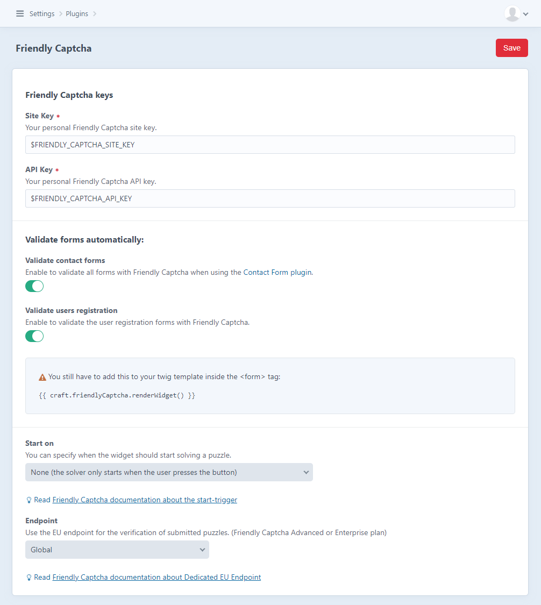

# Friendly Captcha plugin for Craft CMS 3.x and Craft CMS 4.x

Integrate Friendly Captcha to fight spam in your Craft CMS forms


## Requirements

This plugin requires Craft CMS 3.0 or Craft CMS 4.0 or later.

## Installation

To install the plugin, follow these instructions.

1. Open your terminal and go to your Craft project:

       cd /path/to/project

2. Then tell Composer to load the plugin:

       composer require digitalpulsebe/craft-friendly-captcha

   when using Craft 3.x use plugin version 1:

       composer require digitalpulsebe/craft-friendly-captcha:^1.0.0

3. In the Control Panel, go to Settings → Plugins and click the “Install” button for Friendly Captcha. Or run:

       php craft plugin/install friendly-captcha

## Friendly Captcha keys

Create an account for Friendly Captcha [https://friendlycaptcha.com/](https://friendlycaptcha.com/)

Generate a **sitekey** and an **API key** and put them in the plugin settings or .env-file

## Configuring Friendly Captcha



## Using Friendly Captcha

On every form you want to use, you need to render the widget inside the form.

In you template, put this inside the `<form>`-tag 

```
{{ craft.friendlyCaptcha.renderWidget() }}
```

You have to enable the forms you want to validate in the settings:

- Contact Forms [plugin](https://github.com/craftcms/contact-form) (Submission::EVENT_BEFORE_VALIDATE)
- User registration form (User::EVENT_BEFORE_VALIDATE)

When you want to validate the request in your custom controller run this:

```php
use digitalpulsebe\friendlycaptcha\FriendlyCaptcha;

// ...

if (!FriendlyCaptcha::$plugin->validate->validateRequest()) {
   // add error here
}
```

To show error messages in your form, use the submission object (check implementation of the controller you use):

```
{{ craft.friendlyCaptcha.renderWidget() }}
{{ message ? _self.errorList(message.getErrors('friendlyCaptcha')) }}
```

## Using Friendly Captcha with Formie

Use the [digitalpulse/craft-formie-friendly-captcha](https://github.com/digitalpulsebe/craft-formie-friendly-captcha)
plugin with Formie.

## Widget options

You can pass an array of attributes to the `renderWidget()`-function.
Read the [Attribute API HTML tags](https://docs.friendlycaptcha.com/#/widget_api?id=attribute-api-html-tags)-section
in the Friendly Captcha docs.

example:
```
{{ craft.friendlyCaptcha.renderWidget({'data-lang': 'fr'}) }}
```

## Attribution

The Friendly Captcha widget and logo belong to Friendly Captcha